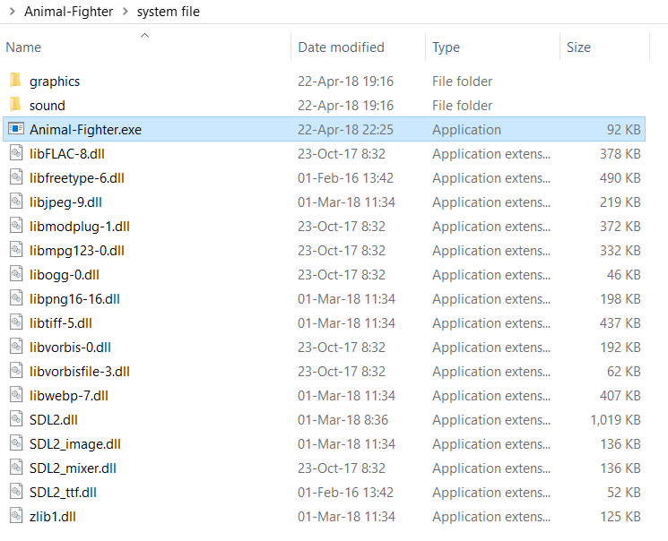

 

# Introduction
 สวัสดีครับ สำหรับกลุ่ม Animal-Fighter พวกเราได้สร้างเกม 2D โดยลักษณะของตัวเกมเบื้องต้น คือเราจะต้องหลบหลีกสัตว์ร้าย และ เก็บระเบิด เพื่อที่จะไปทำลายป้อมของศัตรู
 โปรแกรมนี้ ใช้ภาษา C และ Library SDL ในการเขียน
 
 
 

# Tools

- [SDL](https://www.libsdl.org/download-2.0.php). Library ที่ใช้ในการสร้าง
- [Pixelart](http://pixelartmaker.com/) เว็บสำหรับวาด Sprite (graphics) ที่ใช้ในเกมนี้

 

# How to install 

1. โหลด zip file จาก [Github]( https://github.com/compro-itkmitl/Animal-Fighter)
2. ทำการแตกไฟล์
3. เข้าไปที่ system file > ดับเบิ้ลคลิกที่ Animal-Fighter.exe เพื่อเริ่มเกม (สังเกตได้ว่าภายใน Folder มีไฟล์ .dll ที่จำเป็นมาให้แล้ว )

# How to play

1. เมื่อเปิดเกมแล้ว ให้ กด **Enter** เพื่อเข้าเกม
2. ใช้ปุ่มลูกศร เพื่อเคลื่อนที่
3. หลบหลีกสัตว์ร้าย 
4. เก็บระเบิดเพื่อทำลายป้อมศัตรู 

interface ต่างๆ ภายในเกม

 

1. ตัวละครของเรา 
2. สัตว์ร้ายที่ต้องหลบ 
3-4. ทางซ้ายคือแถบเลือดของเรา ทางขวาแถบเลือดของ Boss (ป้อม) 
5. Boss 
6. ระเบิด ที่ต้องเก็บเพื่อจัดการ Boss 

# Screen Shot 

 

 

 

 

# NOTE!

- มีการลดฟังก์ชั่นการ upgrade ตัวละคร
- ลดฟังก์การเลือกตัวละครที่จะให้สู้ออกไป

> price may vary overtime dedicate price store foreach booking is needed*
# 👥Team Member

|  |
| :-: |
|ธงเงิน แย้ม|
|60070030 |
|    [@ifackerx](https://github.com/ifackerx)    | 

|  |
| :-: |
|ณรงค์เดช ปิ่นปรีชาชัย|
|60070023 |
|    [@narongded](https://github.com/Narongded)    | 

|  |
| :-: |
|ฐิติพัฒ อริยพัฒนา|
|60070021 |

#  Assistant Teacher
|ผศ. ดร. กิติ์สุชาต พสุภา|ผศ. ดร. ปานวิทย์ ธุวะนุติ|
|:-:|:-:|
|||

รายงานนี้เป็นส่วนหนึ่งของวิชา Computer Programming : Information Technology @KMITL

---

