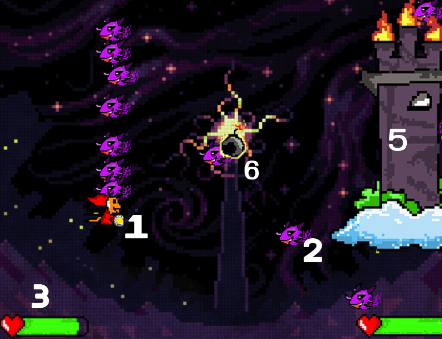
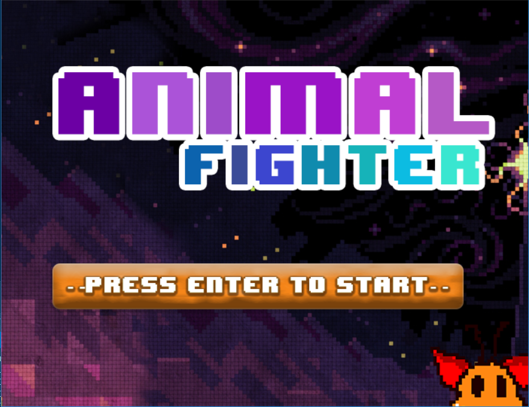

 

# Introduction
 สวัสดีครับ สำหรับกลุ่ม Animal-Fighter พวกเราได้สร้างเกม 2D โดยลักษณะของตัวเกมเบื้องต้น คือเราจะต้องหลบหลีกสัตว์ร้าย และ เก็บระเบิด เพื่อที่จะไปทำร้ายป้อมของศัตรู
 โดยพวกเราได้ใช้ ภาษา C และ Libary SDL2 เข้ามาช่วยในการเขียน
 
 
 

# Tools

- [SDL2](https://www.libsdl.org/download-2.0.php). main libaby ที่ใช้สร้าง 
- [Pixelart](http://pixelartmaker.com/) เว็บสร้าง Sprite (graphics) 

 

# How to install 

1. โหลด zip file จาก Github 
2. ทำการแตกไฟล์
3. เข้าไปที่ Systemfile > Animal-Fighter.exe เพื่อเริ่มเกม

# How to play

1. เมื่อเปิดเกมส์ให้ กด **Enter** เพื่อเข้าเกมส์
2. ใช้ปุ่มลูกศร เพื่อเคลื่อนที่
3. หลบหลีกสัตว์ร้าย 
4. เก็บระเบิดเพื่อทำลายป้อมศัตรู 

interface ต่างๆ ภายในเกม

 

1. ตัวละครของเรา 
2. สัตว์ร้ายที่ต้องหลบ 
3-4. ทางซ้ายคือแถบเลือดของเรา ทางขวาแถบเลือดของ Boss (ป้อม) 
5. Boss 
6. ระเบิด ที่ต้องเก็บเพื่อจัดการ Boss 

# Screen Shot 

 

 

 

# NOTE!

- มีการลดฟังก์ชั่นกัน upgrade 
- ลดฟังก์การเลือกตัวละครที่จะให้สู้ออกไป

#  Team Members
|  |Name|Surname|GitHub Username|Student ID|
|:-:|--|------|---------------|---------|
||Thitipat|Ariyaratana|[@thitipat021](https://github.com/thitipat021)|60070021|
||Narongded|Pinprechachai|[@Narongded](https://github.com/Narongded)|60070023|
||Thong-ngurn|Yampradit|[@ifackerx](https://github.com/ifackerx)|60070030| 

#  Assistant Teacher
|ผศ. ดร. กิติ์สุชาติ พสุภา|ผศ. ดร. ปานวิทย์ ธุวะนุติ|
|:-:|:-:|
|||

รายงานนี้เป็นส่วนหนึ่งของวิชา Computer Programming : Information Technology @KMITL

---

